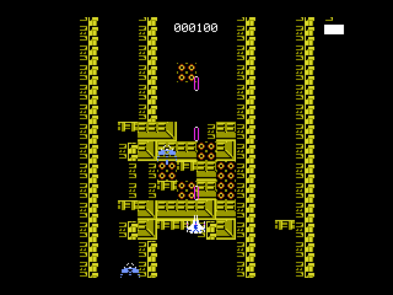
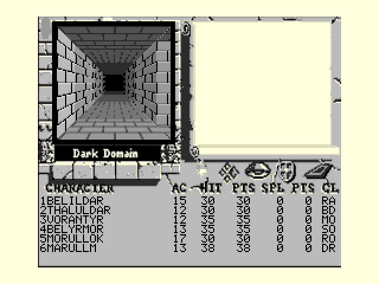
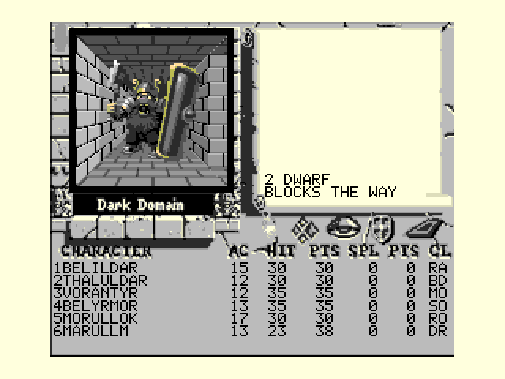

# MSX2 홈브루 — 종스크롤 슈팅과 1인칭 던전

MSX2 + Z80 어셈블리로 만든 카트리지 롬 두 개입니다. 한 저장소에서 같은 도구로 빌드합니다.

| | `game.rom` | `quest.rom` |
|---|---|---|
| 무엇 | Zanac 풍 **종스크롤 슈팅** | Bard's Tale 풍 **1인칭 던전** |
| 크기 | 16KB | 128KB (ASCII8 매퍼) |
| 진입 | `src/main.asm` | `src/quest.asm` |
| 초점 | 60fps 를 놓치지 않는 처리량 | 이동할 때의 쾌적함 |

<p align="center">
  
  
</p>

## 종스크롤 슈팅 (`game.rom`)

Zanac 참고 이미지에서 뽑은 그래픽으로 만들었습니다. 어셈블리로 짰을 때 8비트 MSX2 가 어느 정도 처리량을 내는지 보는 것이 목적입니다.

배경 스크롤은 **VDP 가 공짜로** 해 주고(R#23 수직 스크롤), CPU 는 곧 나타날 픽셀 한 줄(128바이트)만 찍어냅니다. 움직이는 것은 전부 하드웨어 스프라이트라 프레임당 비용은 게임 로직에 작은 VRAM 전송 하나를 더한 정도입니다. **CPU 사용량을 화면에 숫자로 띄웁니다**(`0` 키).

적기, 피격 무적, 난이도 상승, 2분 중간보스와 4분 거대보스, PSG 효과음까지 들어 있고 **60fps 를 놓치지 않습니다.**

→ 자세한 내용: [`README_game.md`](README_game.md)

## 1인칭 던전 (`quest.rom`)

<p align="center">
  
</p>

칸 단위 이동에 90도 회전만 있는 Wizardry / Bard's Tale 형식입니다. **실행 중에 레이캐스팅을 하지 않습니다.**

칸 단위로만 움직이면 화면에 나올 벽면의 모양이 서 있는 위치와 무관하게 언제나 같습니다. 모양이 상수면 그 위에 입히는 텍스처도 상수입니다. 그래서 화면좌표 → 텍스처좌표 변환을 **원근 나눗셈까지 포함해 빌드 시점에 전부 풀어 픽셀로 구워** 둡니다. 실행 중에 Z80 이 하는 일은 "이 칸이 벽인가"를 보고 바이트를 옮기는 것뿐입니다. 한 번 다시 그리는 데 **92ms** 입니다.

파티와 전투는 파이썬으로 짜 둔 D&D 구현에서 **판정 계층을 그대로 옮겼습니다.** 능력치 보정과 기본 공격 보정은 파이썬 원본을 빌드할 때 실제로 실행해서 표로 구워 넣습니다 — `(점수-10)//2` 의 내림 나눗셈이나 `int(레벨*0.75)` 같은 것을 Z80 에서 흉내 내면 틀리기 쉽기 때문입니다.

전투는 Bard's Tale 처럼 한 명씩 번갈아 치고, 오른쪽 양피지 창에 기록이 흘러갑니다(V9938 명령 엔진의 HMMM/HMMV).

→ 자세한 내용: [`README_quest.md`](README_quest.md)

## 빌드

```powershell
.\build.ps1          # src/main.asm  -> build/game.rom  (16KB)
.\build_quest.ps1    # src/quest.asm -> build/quest.rom (128KB)

.\run.ps1            # game.rom 을 창으로 실행
.\verify.ps1         # 창 없이 부팅해 화면을 저장
.\verify_quest.ps1
```

필요한 것은 **sjasmplus 1.23.1**, **openMSX 21.0**, **uv**(파이썬) 셋입니다. 도구 경로는 `tools.ps1` 한 곳에만 적혀 있습니다.

환경 준비, 128KB 롬을 세 번 나눠 어셈블해서 이어 붙이는 방법, sjasmplus 로 카트리지 롬을 만들 때의 함정은 여기에 정리했습니다.

→ **[`doc/build_setup.md`](doc/build_setup.md)**

## 문서

| 문서 | 내용 |
|---|---|
| [`doc/build_setup.md`](doc/build_setup.md) | 빌드 환경과 절차, sjasmplus 함정 |
| [`doc/z80_mult_div.md`](doc/z80_mult_div.md) | Z80 곱셈·나눗셈 ([Grauw 문서](https://map.grauw.nl/articles/mult_div_shifts.php) 정리) |
| [`README_game.md`](README_game.md) | 슈팅 게임 — 처리량, 하드웨어 스크롤, 스프라이트 한계 |
| [`README_quest.md`](README_quest.md) | 던전 게임 — 원근 굽기, D&D 포팅, 겪은 버그들 |

## 저장소 구조

```
src/     어셈블리 원본 (quest*.asm 중 일부는 생성물)
gfx/     파이썬 생성기 - PNG 와 규칙표를 .asm 으로 굽는다
doc/     문서
build/   결과물 (완성된 .rom 만 저장소에 남긴다)
*.ps1    빌드 / 실행 / 검증 스크립트
```

**그래픽과 표는 파이썬이 빌드 시점에 계산해서 `.asm` 으로 내보냅니다.** Z80 이 실행 중에 할 일을 최대한 줄이려는 것입니다. `src/` 안의 생성 파일은 맨 위에 그렇게 적혀 있고, 직접 고치지 않습니다.

## 참고 자료 출처

배경과 화면 배치는 Bard's Tale 화면을 참고했고, 몬스터 그림과 슈팅 게임 그래픽은 개인 습작 프로젝트에서 쓰던 것을 가져왔습니다. **원저작자가 따로 있는 소재가 섞여 있으므로 학습·시연 목적으로만 봐 주세요.**
